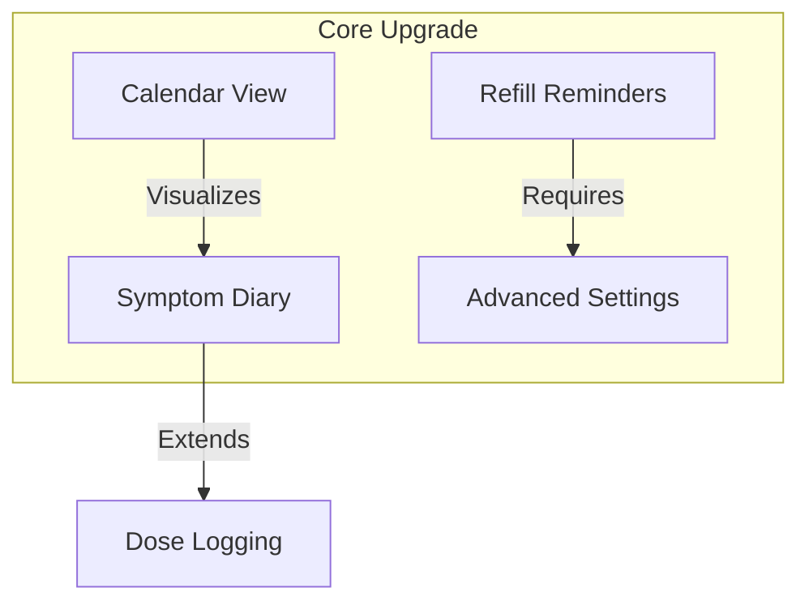

# NEXT_UPGRADE_PLAN.md
# v1.1.0: "Insights, Automation & Health Diary" — Upgrade Plan

This document outlines the detailed roadmap, technical execution, and verification plans for the next major upgrade of the Home Medication Manager.

---

## 1. Executive Summary

Having successfully bootstrapped the core platform and implemented Phase P0 (Adherence Dashboard & Search/Filter/Sort), the next logical iteration focuses on **user utility, planning visualizers, and health diary outcomes**. 

We propose bundling the next three high-value features alongside an advanced settings panel into the **v1.1.0 Release: "Insights, Automation & Health Diary"**.

### v1.1.0 Upgrade Scope


---

## 2. Feature Specification & Implementation Plan

### 2.1 Refill Reminders (Predictive Analytics)
**Goal:** Automatically calculate medication exhaustion dates based on active schedule consumption and trigger alerts/push notifications when stock runs low.

```
                  [Current Stock]
Exhaustion Day = ─────────────────
                  [Doses Per Day]
```

#### Architecture Changes:
*   **Domain Layer**:
    *   `lib/features/inventory/domain/services/refill_calculator.dart`: Computes predicted exhaustion dates using recurrence rule statistics (e.g., Daily 3x = 3/day, Weekly Mon/Wed = 2/7 per day).
    *   `lib/features/inventory/domain/entities/refill_alert.dart`: Holds `Medication`, days remaining, and exhaustion `DateTime`.
    *   Use cases: `GetRefillAlerts`, `ScheduleRefillReminders`.
*   **Data Layer**:
    *   No database additions required. Reads directly through the existing `InventoryRepository` and `ScheduleRepository`.
*   **Presentation Layer**:
    *   `lib/features/inventory/presentation/cubit/refill_alert_cubit.dart`: Reactively updates on stock adjustments or schedule mutations.
    *   **UI Hook**: Yellow dashboard warning banner; "Refill soon" badges on inventory cards.

---

### 2.2 Interactive Calendar View
**Goal:** Introduce a month visualizer on the schedules screen to view historical status and future reminders at a glance.

#### Architecture Changes:
*   **External Library**: Add `table_calendar: ^3.1.2`
*   **Domain Layer**:
    *   `lib/features/schedule/domain/entities/calendar_dose.dart`: Status projection (`taken`, `skipped`, `pending`, `missed`).
    *   `lib/features/schedule/domain/services/schedule_calendar_builder.dart`: Projects schedule recurrence rules and logs onto calendar days.
*   **Presentation Layer**:
    *   `lib/features/schedule/presentation/pages/schedule_calendar_view.dart`: Month matrix with status-colored event dots.
    *   **UI Hook**: A premium sliding `SegmentedButton` in the AppBar of the schedule screen allowing toggling between `List View` and `Calendar View`.

---

### 2.3 Symptom & Side-Effects Diary
**Goal:** Allow users to log general health status (vitals, pain, mood) and link specific symptoms or side-effects directly to a dose log.

#### Architecture Changes:
*   **Data Layer**:
    *   **New Hive Box**: `symptoms_box` (TypeId: 40).
    *   Extend `DoseLogModel` with an optional `sideEffectId` string.
*   **Domain Layer**:
    *   `lib/features/symptoms/domain/entities/symptom_entry.dart`: `id`, `occurredAt`, `severity` (mild/moderate/severe), `notes`, and optional `relatedMedicationId`.
    *   Use cases: `LogSymptom`, `GetSymptomsTimeline`, `DeleteSymptom`.
*   **Presentation Layer**:
    *   `lib/features/symptoms/presentation/pages/symptom_timeline_page.dart`: Chronological history logs.
    *   `lib/features/symptoms/presentation/pages/log_symptom_page.dart`: Interactive form featuring severity color sliders.
    *   **UI Hook**: "Report Side Effects" quick shortcut in the `DoseActionSheet`.

---

### 2.4 Advanced Settings Expansion
**Goal:** Expand settings to include personalization, threshold configs, and clinical export utility.

#### Upgrades:
1.  **Personalized Alerts**: Configure low-stock warnings (3, 5, 7, or 14 days before depletion).
2.  **Clinical Export (CSV/PDF)**: Generate formatted adherence reports to easily share with doctors.
3.  **Appearance Mode**: System, Light, and Dark themes toggle using `ThemeMode`.
4.  **Database Management**: Secure option to backup/restore Hive boxes locally or reset database context.

---

## 3. Detailed Work Breakdown Checklist

- [ ] **Refill Reminders**
  - [ ] Write `RefillCalculator` tests (daily, weekly, PRN boundary cases)
  - [ ] Implement `RefillCalculator` service
  - [ ] Implement `GetRefillAlerts` and `ScheduleRefillReminders` use cases
  - [ ] Extend `NotificationScheduler` with low-stock notification triggers
  - [ ] Create `RefillAlertCubit` state machine
  - [ ] Wire warning banners on Dashboard and stock warning labels in Inventory UI
- [ ] **Interactive Calendar**
  - [ ] Add `table_calendar` to `pubspec.yaml`
  - [ ] Implement local timezone-safe `ScheduleCalendarBuilder`
  - [ ] Build interactive month-view layout with custom indicators
  - [ ] Wire List/Calendar toggle switch in Schedule page
- [ ] **Symptom & Side-Effects Diary**
  - [ ] Add `symptoms_box` and create Hive adapters
  - [ ] Build Hive migration sequence to update legacy `DoseLog` models
  - [ ] Implement symptom CRUD use cases and BLoC
  - [ ] Build Symptom Timeline UI and Log Symptom Form Page
  - [ ] Add "Report Side Effect" hook inside the dose logger page
- [ ] **Advanced Settings & Personalization**
  - [ ] Add `themeMode` and `refillAlertDays` fields to `SettingsState`
  - [ ] Add settings selector widgets (Theme switcher, low-stock window picker)
  - [ ] Build clinical adherence CSV export service

---

## 4. Navigation & Architecture Flow

```
Tab Navigation (Material 3 ShellRoute)
 ├── Dashboard Screen
 │    └── Quick stats, upcoming list, and LOW-STOCK warning banner
 ├── Schedule Screen
 │    └── List View ──[Toggle]──> Month Calendar View
 │                                  └── Tap Day ──> Detailed Dose List
 ├── Inventory Screen
 │    └── Filter chips, Search, and Low-stock indicator pills
 ├── Symptoms Timeline Screen (New Screen)
 │    └── Pain/Mood logs and Side-effect records
 └── Settings Screen
      └── Adjust Refill Window, Theme Switcher, and Export CSV
```

---

## 5. Verification & Testing Plan

### 5.1 Unit Tests
*   **`refill_calculator_test.dart`**: Verify calculation accuracy for:
    *   Regular daily schedules (e.g., 3 tablets a day starting with 10 remaining = empty in 3.3 days).
    *   Weekly schedules (e.g., Mon/Wed/Fri starting with 6 remaining = empty in 14 days).
    *   PRN (as-needed) schedules (verify it is safely ignored).
*   **`schedule_calendar_builder_test.dart`**: Verify status dot colors for taken, skipped, missed, and upcoming projection logs.
*   **`symptoms_bloc_test.dart`**: Verify correct state transitions on adding, editing, and deleting symptoms.

### 5.2 Widget & UI Integration Tests
*   **`refill_banner_test.dart`**: Verify warning banner shows only when medication stock goes below the threshold configured in settings.
*   **`calendar_toggle_test.dart`**: Verify toggling between calendar and list view keeps the selected profile context intact.
*   **`symptom_form_validation_test.dart`**: Verify severity and note requirements in symptom entries.
